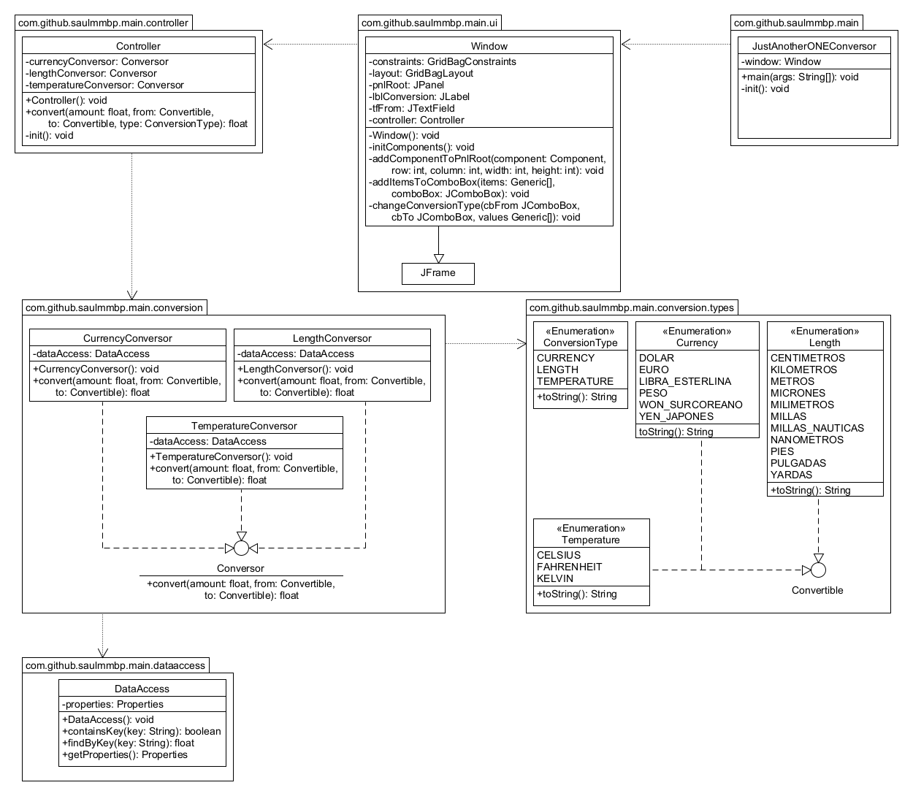

# Just Another ONE Conversor (JAOC)
## Planteamiento

¡Bienvenido al primer desafío del Challenge Java!

En esta oportunidad, a los Devs se nos solicitó crear un conversor de divisas utilizando el lenguaje Java. Las características solicitadas por nuestro cliente son las siguientes:

Requisitos:

- El convertidor de moneda debe:

> - Convertir de la moneda de tu país a Dólar
> - Convertir de la moneda de tu país  a Euros
> - Convertir de la moneda de tu país  a Libras Esterlinas
> - Convertir de la moneda de tu país  a Yen Japonés
> - Convertir de la moneda de tu país  a Won sul-coreano

Recordando que también debe ser posible convertir inversamente, es decir:

> - Convertir de Dólar a la moneda de tu país
> - Convertir de Euros a la moneda de tu país
> - Convertir de Libras Esterlinas a la moneda de tu país
> - Convertir de Yen Japonés a la moneda de tu país
> - Convertir de Won sul-coreano a la moneda de tu país

### Extras

Como desafío extra te animamos a que dejes fluir tu creatividad, si puedo convertir divisas, ¿tal vez pueda añadir a mi programa otros tipos de conversiones como temperatura por ejemplo?

Es hora de sorprender a nuestro cliente con una función que tal vez ni siquiera sabía que necesitaba.

En la sección de Anexos hay un gif explicando como podría funcionar la aplicación

### Anexos


## Solución
### Cálculo de conversión
```
// 1 moneda1 = C moneda2
// X moneda1 -> Y moneda2
Y = X * C

// Y moneda2 -> X moneda1
X = Y / C
```

### UML Diagram



### Interface gráfica


## ¿Cómo ejecutar el programa?
1. El programa está realizado con java 17, por lo que hay que asegurarse de tener dicha versión instalada. 
2. Descargar el JAR ejecutable
[Descargar Zip](https://github.com/SaulMMBP/JustAnotherONEConversor/releases/download/v1.0.0/Conversor_de_moneda_-_ChallengeONE_java.zip)
3. Descomprimir el zip que contiene dos archivos, conversor.properties y jaoc.jar
4. Asegurarse que conversor.properties y jaoc.jar se encuentren en la misma carpeta
5. Ejecutar jaoc.jar (Doble click)

**Nota**: El archivo conversor.properties contiene el importe de cada moneda por lo que se pueden modificar para ajustarse a los precios actuales. Por ejemplo, el campo DOLAR_PESO contiene el valor del dolar en pesos mexicanos.
